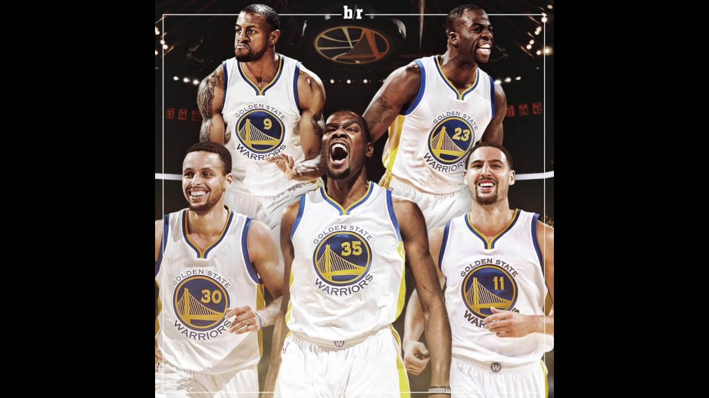
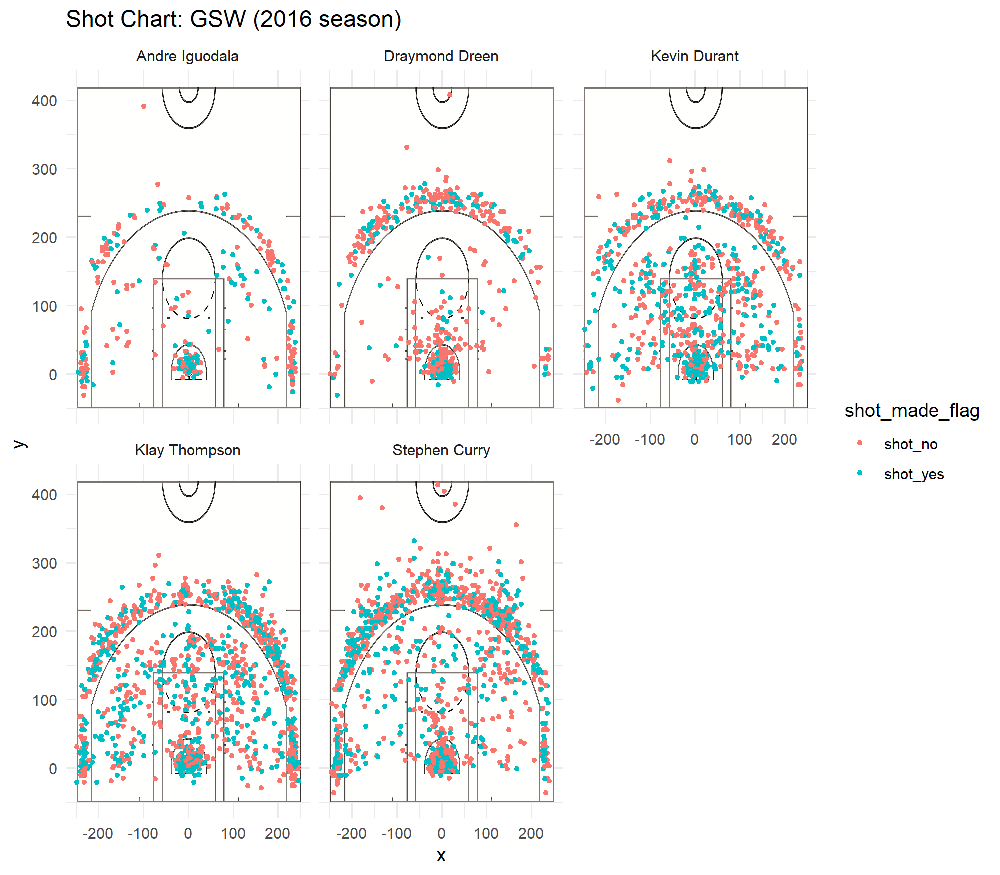
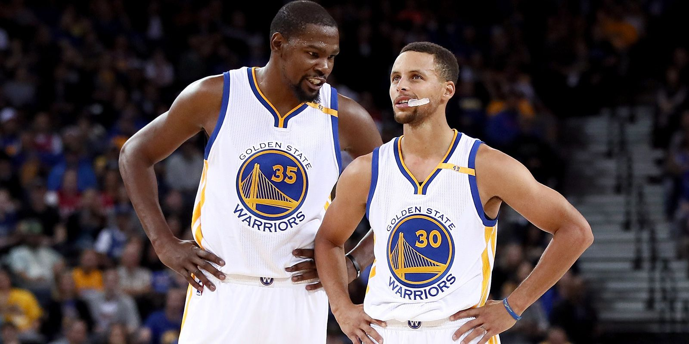

```{r setup, echo=FALSE, warning=FALSE, results='hide', message=FALSE}
library(dplyr)
library(knitr)

datatype <- c("character", "character", "integer", "integer", "integer", "integer", 
              "factor", "factor", "factor", "integer", "factor", "integer", 
              "integer", "factor", "integer")
shotsdata <- read.csv("../data/shots-data.csv", colClasses = datatype, stringsAsFactors = FALSE)
```


# Who Has the Best Clutch Time Performance on Golden State Warriors?

```{r photo1, out.width='80%', echo=FALSE, fig.align='center'}

```


## Introduction

The most interesting and thrilling part about basketball is that the result of a game can change rapidly during clutch time. Many games are determined by a final shot just a few seconds before a game ends. In basketball, the term **clutch time** is defined as "during the 4th quarter or overtime, with less than five minutes remaining, and neither team ahead by more than five points." Players' ability to make the final shot of a close game during final minutes is often crucial to the success of a team. Hence, the decision of athletes and coaches on who to execute the final shot is extremely important.

In this report, I will be looking at data of 5 main players of the NBA team Golden State Warriors, and try to figure out who has the best clutch time performance and whom the team should rely on during clutch time.


## Data

The analysis in this report is based on the data set of the NBA team Golden State Warriors during 2016-2017 season. For more information, please see *data-dictionary.md*.

The 5 main players I will be looking at are:  
+ 9 Andre Iguodala  
+ 23 Draymond Green  
+ 35 Kevin Durant  
+ 11 Klay Thompson  
+ 30 Stephen Curry  

To understand the clutch time performance, I will be looking at **shot charts** and **effective shooting percentages** of each player, especially **effective shooting percentages during last 5 minutes of games**. The effective shooting percentage is calculated by total shots / made shots.   
+ 2PT Effective Shooting Percentage by Player: 2 PT Field Goal effective shooting percentage by player, arranged in descending order by percentage.   
+ 3PT Effective Shooting Percentage by Player: 3 PT Field Goal effective shooting percentage by player, arranged in descending order by percentage.   
+ Effective Shooting Percentage by Player: Overall (i.e. including 2PT and 3PT Field Goals) effective shooting percentage by player, arranged in descending order by percentage.   


## Analysis

#### 1. Effective Shooting Percentage

Before looking into stats of clutch time, we first take a look at the data of the whole games to get a sense of each player's overall performance. Followings are there tables of effective shooting percentages:

* **2PT Effective Shooting Percentage by Player**
```{r}
effective_shooting_2pt <- shotsdata %>%
  group_by(name) %>%
  summarise(total = sum(shot_type == "2PT Field Goal"), 
            made = sum(shot_made_flag == "shot_yes" & shot_type == "2PT Field Goal"), 
            perc_made = made/total) %>%
  arrange(desc(perc_made))

kable(effective_shooting_2pt)
```

* **3PT Effective Shooting Percentage by Player**
```{r}
effective_shooting_3pt <- shotsdata %>%
  group_by(name) %>%
  summarise(total = sum(shot_type == "3PT Field Goal"), 
            made = sum(shot_made_flag == "shot_yes" & shot_type == "3PT Field Goal"), 
            perc_made = made/total) %>%
  arrange(desc(perc_made))

kable(effective_shooting_3pt)
```

* **Effective Shooting Percentage by Player**
```{r}
effective_shooting_total <- shotsdata %>%
  group_by(name) %>%
  summarise(total = sum(shot_made_flag == "shot_yes") + sum(shot_made_flag == "shot_no"), 
            made = sum(shot_made_flag == "shot_yes"), 
            perc_made = made/total) %>%
  arrange(desc(perc_made))

kable(effective_shooting_total)
```

From the tables above, we can tell that though Andre Iguodala has a relatively high effective shooting percentage, the main scorers on the Golden State Warriors are Kevin Durant, Klay Thompson, and Stephen Curry. They have a lot more attempts than Andre Iguodala and Draymond Green. As a result, I will only be considering Durant, Thompson, and Curry later on in this report when looking into data of clutch time since scoring is probably not Iguodala's and Green's main tasks on this team.


#### 2. Shot Charts

Shot charts can be a key indicator of how teams and players are performing.

```{r shotcharts, out.width='80%', echo=FALSE, fig.align='center'}

```

From the charts above, we can tell that, Andre Iguodala and Draymond Green obviously have less shots, which is the same as what we just discussed. Moreover, by looking at the location and the density of the dots, we can observe that Klay Thompson and Stephen Curry are better three¡Vpointers and Kevin Durant is a better 2-pointer. This result is consistent with the one from effective shooting percentages in previous part of the report. Understanding this fact can help decide what to do in clutch situations. I will take about it more later.


#### 3. Effective Shooting Percentage of Last 5 Minutes

To get more accurate insights on clutch time performance, we next look at the stats of effective shooting percentage of last 5 minutes of games.

* **2PT Effective Shooting Percentage of Last 5 Minutes by Player**
```{r}
effective_shooting_2pt_last5 <- shotsdata %>%
  filter(minute >= 44) %>%
  group_by(name) %>%
  summarise(total = sum(shot_type == "2PT Field Goal"), 
            made = sum(shot_made_flag == "shot_yes" & shot_type == "2PT Field Goal"), 
            perc_made = made/total) %>%
  arrange(desc(perc_made))
kable(effective_shooting_2pt_last5)
```

* **3PT Effective Shooting Percentage of Last 5 Minutes by Player**
```{r}
effective_shooting_3pt_last5 <- shotsdata %>%
  filter(minute >= 44) %>%
  group_by(name) %>%
  summarise(total = sum(shot_type == "3PT Field Goal"), 
            made = sum(shot_made_flag == "shot_yes" & shot_type == "3PT Field Goal"), 
            perc_made = made/total) %>%
  arrange(desc(perc_made))
kable(effective_shooting_3pt_last5)
```

* **Effective Shooting Percentage of Last 5 Minutes by Player**
```{r}
effective_shooting_total_last5 <- shotsdata %>%
  filter(minute >= 44) %>% 
  group_by(name) %>% 
  summarise(total = sum(shot_made_flag == "shot_yes") + sum(shot_made_flag == "shot_no"), 
            made = sum(shot_made_flag == "shot_yes"), 
            perc_made = made/total) %>%
  arrange(desc(perc_made))
  
kable(effective_shooting_total_last5)
```

From the tables above, we can observe that, from the perspective of effective shooting percentages of last 5 minutes, Kevin Durant has the best **overall** clutch time performance. Passing the ball to Durant or having him to execute the final shot in clutch situations might give the Golden State Warriors a better chance to win the game.

However, the **3PT** effective shooting percentage of last 5 minutes of Stephen Curry is a lot higher than Kevin Durant's. We can also see very clearly form the shot charts in previous part that Curry is a great three-point shooter. In a situation which it is possible to make a three-point shot, passing the ball to Curry more often and helping him get more offense opportunities might give the Golden State Warriors a better chance to win the game.

* **Effective Shooting Percentage of Last 1 Minute by Player**
```{r}
effective_shooting_total_last1 <- shotsdata %>%
  group_by(name) %>%
  filter(minute == 48) %>%
  summarise(
    total = sum(shot_made_flag == "shot_yes") + sum(shot_made_flag == "shot_no"),
    made = sum(shot_made_flag == "shot_yes"),
    perc_made = made / total
  ) %>%
  arrange(desc(perc_made))

kable(effective_shooting_total_last1)
```

It would be even more helpful for our analysis if we also take a look at effective shooting percentages of last 1 minute. However, for statistical reason, it is not realistic to do that in this report since we have too little samples.


## Conclusion

When it comes to which player is a better clutch performer on the Golden State Warriors, the discussion is usually surrounding Kevin Durant and Stephen Curry. According to the analysis above, we can conclude that, from the perspective of effective shooting percentages, whom the Golden State Warriors should rely on during clutch time depends on the shot location. Kevin Durant has the best overall and 2PT effective shooting percentages of last 5 minutes, and has better clutch time performance in these two aspects. Stephen Curry has the best 3PT effective shooting percentages of last 5 minutes, and has better clutch time performance in this aspect. When they only need 2 points to win or tie the game, or a two-point shot is the best choice of that current situation, giving Durant more opportunities to make attempts might be the better decision. On the other hand, when they need 3 points to win or tie the game, or a three-point shot is the best choice of that current situation, passing the ball to Curry more often and helping him get more offensive opportunities might give the team a better chance to win the game.

```{r photo2, out.width='80%', echo=FALSE, fig.align='center'}

```


## References

* [First Photo](https://www.youtube.com/watch?v=hzfh5nIHM0g)  
* [Second Photo](http://www.espn.com/espn/feature/story/_/id/19256296/golden-state-warriors-steph-curry-stopped-only-kevin-durant)  
* [Clutch Time Stats](http://www.nbaminer.com/clutch-time-stats/)  
* [Understanding Clutch Time Decisions: Myths and Truths (by Konstantinos Kotzias)](https://statathlon.com/understanding_clutch_time/)  
* [Analytics & Shot Selection (by Stephen Shea)](https://shottracker.com/articles/analytics-shot-selection)  


