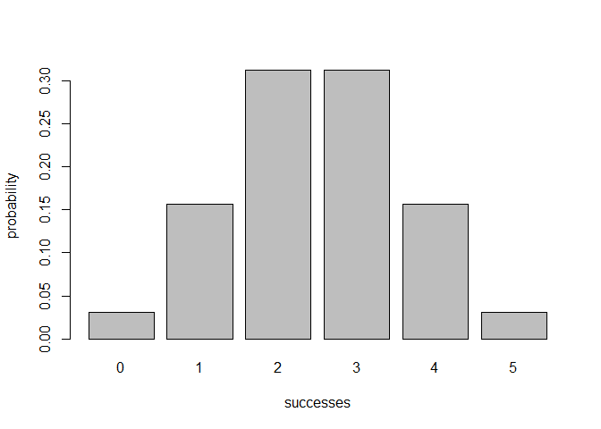
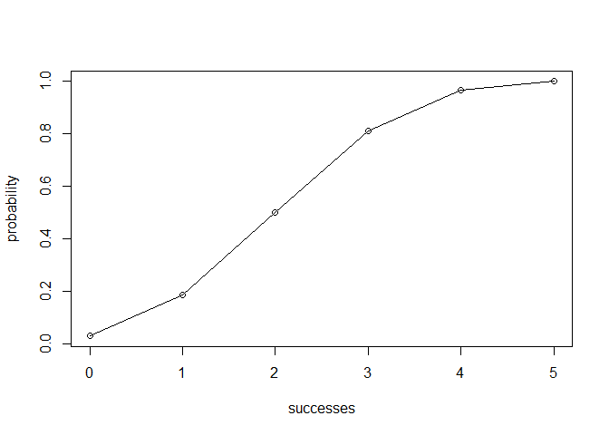

<!-- README.md is generated from README.Rmd. Please edit README.Rmd -->
R Package binomial
==================

This is a workout assignment from \[STAT133\]Concepts in Computing with Data.

The purpose of this assignment is to create an R package that implements functions for calculating probabilities of a binomial random variable, and related calculations such as the probability distribution, the expected value, variance, etc.

------------------------------------------------------------------------

Overview
--------

In this R package:
- `bin_distribution()` will return a data frame of class `bindis`, with two columns success, probability, and cumulative probability. - `bin_cumulative()` will return a data frame of class `bincum`, with two columns success, probability, and cumulative probability in the third. - `bin_variable()` will return an object of class `binvar`. - `plot()` are methods for objects of classes `bindis` and `bincum`. - `print()` are methods for objects of classes `binvar` and `summary.binvar`. - `summary()` is a method for objects of class `binvar`. - Description for other functions can be found in the introduction.Rmd file in the folder "vignettes".

Motivation
----------

The purpose of this package is to help the author get in touched with building R packages and provide tools for calculating probabilties of binomial random variables.

Installation
------------

Install the development version from GitHub via the package `"devtools"`:

``` r
# development version from GitHub:
install.packages("devtools") 
# install "binomial" (without vignettes)
devtools::install_github("stat133-sp19/hw-stat133-yichiehc/tree/master/workout03/binomial")
# install "binomial" (with vignettes)
devtools::install_github("stat133-sp19/hw-stat133-yichiehc/tree/master/workout03/binomial", build_vignettes = TRUE)
```

Usage
-----

``` r
library(binomial)
## some examples
# binomial probability of getting 2 successes in 5 trials,assuming prob of success = 0.5
bin_probability(success = 2, trials = 5, prob = 0.5)
#> [1] 0.3125
# binomial probability distribution of getting possible successes in 5 trials,assuming prob of success = 0.5
bin_distribution(trials = 5, prob = 0.5)
#>   success probability
#> 1       0     0.03125
#> 2       1     0.15625
#> 3       2     0.31250
#> 4       3     0.31250
#> 5       4     0.15625
#> 6       5     0.03125
# plotting binomial probability distribution
dis1 <- bin_distribution(trials = 5, prob = 0.5)
plot(dis1)
```



``` r
# binomial cumulative distribution  of getting possible successes in 5 trials,assuming prob of success = 0.5
bin_cumulative(trials = 5, prob = 0.5)
#>   success probability cumulative
#> 1       0     0.03125    0.03125
#> 2       1     0.15625    0.18750
#> 3       2     0.31250    0.50000
#> 4       3     0.31250    0.81250
#> 5       4     0.15625    0.96875
#> 6       5     0.03125    1.00000
# plotting binomial cumulative distribution
dis2 <- bin_cumulative(trials = 5, prob = 0.5)
plot(dis2)
```



``` r
# binomial variable
bin1 <- bin_variable(trials = 10, p = 0.3)
bin1
#> "Binomial variable"
#> 
#> Parameters
#> - number of trials:  10 
#> - prob of successs:  0.3
# summary of a binomial variable
bin1 <- bin_variable(trials = 10, p = 0.3)
binsum1 <- summary(bin1)
binsum1
#> "Summary Binomial"
#> 
#> Parameters
#> - number of trials:  10 
#> - prob of successs:  0.3 
#> 
#> Measures
#> - mean    :  3 
#> - variance:  2.1 
#> - mode    :  3 
#> - skewness:  0.2760262 
#> - kurtosis:  -0.1238095
# functions of measures
bin_mean(10,0.3)
#> [1] 3
bin_variance(10, 0.3)
#> [1] 2.1
bin_mode(10, 0.3)
#> [1] 3
bin_skewness(10, 0.3)
#> [1] 0.2760262
bin_kurtosis(10, 0.3)
#> [1] -0.1238095
```

------------------------------------------------------------------------

### **Author**

Yi Chieh Chen
